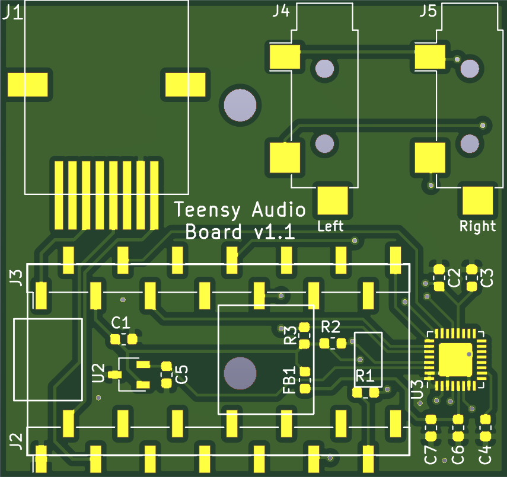
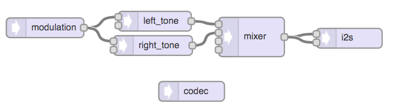

Design based on [Teensy Audio Adaptor Board](https://www.pjrc.com/store/teensy3_audio.html)

## Bill Of Materials
| Qty | Reference  | Description         | Value/MPN                                                                                                            | 
|-----|------------|---------------------|----------------------------------------------------------------------------------------------------------------------|
| 3   | C2, C3, C7 | 0603 Capacitor      | [100nF](https://www.digikey.com/products/en?keywords=1276-1258-1-ND)                                                 | 
| 1   | C4         | 0603 Capacitor      | [150nF](https://www.digikey.com/product-detail/en/kemet/C0603C154K8RACTU/399-7862-1-ND/3471585)                      | 
| 2   | C5, C1     | 0603 Capacitor      | [1.0µF](https://www.digikey.com/products/en?keywords=1276-6524-1-ND)                                                 | 
| 1   | C6         | 0603 Capacitor      | [2.2µF](https://www.digikey.com/products/en?keywords=1276-1040-1-ND)                                                 | 
| 1   | FB1        | 0603 Ferrite Bead   | [600Ω @ 100MHz](https://www.digikey.com/products/en?keywords=445-2166-1-ND)                                          | 
| 1   | J1         | RJ45 Jack           | [0855025008](https://www.digikey.com/products/en?keywords=WM3547CT-ND)                                               | 
| 2   | J3, J2     | 14pin Female Header | [SSM-114-L-SV-BE](https://www.digikey.com/products/en?keywords=SSM-114-L-SV-BE-ND)                                   | 
| 2   | J4, J5     | Mono Audio Jack     | [MJ-3523-SMT](https://www.digikey.com/products/en?keywords=CP-3523MJCT-ND)                                           | 
| 1   | R1         | 0603 Resistor       | [100Ω](https://www.digikey.com/products/en?keywords=311-100HRCT-ND)                                                  | 
| 2   | R3, R2     | 0603 Resistor       | [2.2KΩ](https://www.digikey.com/products/en?keywords=A130093CT-ND)                                                   | 
| 1   | U2         | 1.8V LDO Regulator  | [AP7313](https://www.digikey.com/product-detail/en/diodes-incorporated/AP7313-18SAG-7/AP7313-18SAG-7DICT-ND/2270838) | 
| 1   | U3         | Codec IC            | [SGTL5000](https://www.digikey.com/products/en?keywords=SGTL5000XNAA3R2CT-ND)                                        | 

## Firmware
[Audio System Design Tool](https://www.pjrc.com/teensy/gui/index.html)

