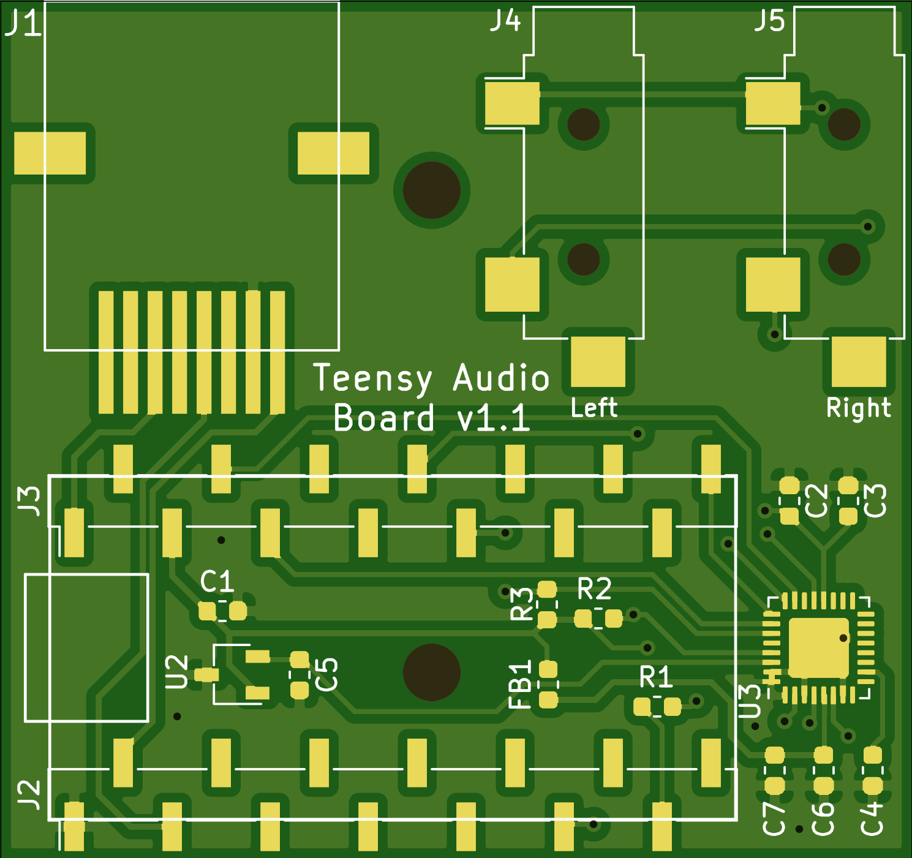

# Teensy Audio Board for pyControl


This device connects with a [pyControl breakout](https://karpova-lab.github.io/pyControl-D-Series-Breakout/index.html) to play audio tones. 
A [Teensy 3.2](https://www.pjrc.com/teensy/index.html) generates an i2s audio signal which is later decompressed and amplified by the SGTL5000 codec IC. 
A left and right amplified signal is output to two separate mono headphone jacks. The design of this pcb is based on the [Teensy Audio Adaptor Board](https://www.pjrc.com/store/teensy3_audio.html).


## Bill Of Materials
| Qty | Reference  | Description         | Value/MPN                                                                                                            | 
|-----|------------|---------------------|----------------------------------------------------------------------------------------------------------------------|
| 3   | C2, C3, C7 | 0603 Capacitor      | [100nF](https://www.digikey.com/products/en?keywords=1276-1258-1-ND)                                                 | 
| 1   | C4         | 0603 Capacitor      | [150nF](https://www.digikey.com/product-detail/en/kemet/C0603C154K8RACTU/399-7862-1-ND/3471585)                      | 
| 2   | C5, C1     | 0603 Capacitor      | [1.0µF](https://www.digikey.com/products/en?keywords=1276-6524-1-ND)                                                 | 
| 1   | C6         | 0603 Capacitor      | [2.2µF](https://www.digikey.com/products/en?keywords=1276-1040-1-ND)                                                 | 
| 1   | FB1        | 0603 Ferrite Bead   | [600Ω @ 100MHz](https://www.digikey.com/products/en?keywords=445-2166-1-ND)                                          | 
| 1   | J1         | RJ45 Jack           | [54602-908LF](https://www.digikey.com/en/products/detail/54602-908LF/609-1046-ND/1001360)                            | 
| 2   | J3, J2     | 14pin Female Header | [SSM-114-L-SV-BE](https://www.digikey.com/products/en?keywords=SSM-114-L-SV-BE-ND)                                   | 
| 2   | J4, J5     | Mono Audio Jack     | [4832.2230](https://www.digikey.com/en/products/detail/schurter-inc/4832-2230/1731054?s=N4IgTCBcDaICwA4BsBaAzHAjAdhAXQF8g)| 
| 1   | R1         | 0603 Resistor       | [100Ω](https://www.digikey.com/products/en?keywords=311-100HRCT-ND)                                                  | 
| 2   | R3, R2     | 0603 Resistor       | [2.2KΩ](https://www.digikey.com/products/en?keywords=A130093CT-ND)                                                   | 
| 1   | U2         | 1.8V LDO Regulator  | [AP7313](https://www.digikey.com/product-detail/en/diodes-incorporated/AP7313-18SAG-7/AP7313-18SAG-7DICT-ND/2270838) | 
| 1   | U3         | Codec IC            | [SGTL5000](https://www.digikey.com/products/en?keywords=SGTL5000XNAA3R2CT-ND)                                        | 

### [View interactive BOM](https://karpova-lab.github.io/audio_teensy/ibom)



## Example Firmware for Teensy
This following firmware creates 6.5KHz and 14KHz sine waves that are frequency modulated at 6.66 Hz. 
It responds to commands received over serial UART. 'L' plays the left tone, 'R' plays the right tone, 'S' stops playing both tones, 'V,5' adjust the volume to 5. 
This firmware is loaded onto the Teensy microcontroller. 

[Audio System Design Tool](https://www.pjrc.com/teensy/gui/index.html)

 

```c++
#include <Audio.h>
#include <Wire.h>
#include <SPI.h>
#include <SD.h>
#include <SerialFlash.h>

// GUItool: begin automatically generated code
AudioSynthWaveformSine   modulation;     //xy=323.0056381225586,328.0056438446045
AudioSynthWaveformModulated left_tone;   //xy=530.0056648254395,308.0056457519531
AudioSynthWaveformModulated right_tone;   //xy=533.1874694824219,363.0965919494629
AudioMixer4              mixer;         //xy=719.1874771118164,330.0965805053711
AudioOutputI2S           i2s;            //xy=868.0056648254395,332.0056505203247
AudioConnection          patchCord1(modulation, 0, left_tone, 0);
AudioConnection          patchCord2(modulation, 0, right_tone, 0);
AudioConnection          patchCord3(left_tone, 0, mixer, 0);
AudioConnection          patchCord4(right_tone, 0, mixer, 1);
AudioConnection          patchCord5(mixer, 0, i2s, 0);
AudioConnection          patchCord6(mixer, 0, i2s, 1);
AudioControlSGTL5000     codec;          //xy=607.0056762695312,492.0056781768799
// GUItool: end automatically generated code

int current_waveform=0;
const int LED = 13;

void setup() {
  // put your setup code here, to run once:
  AudioMemory(10);
  codec.enable();
  codec.volume(0.10);

  modulation.frequency(20/3.0);
  modulation.amplitude(.019);

  left_tone.frequency(6500);
  left_tone.amplitude(1.0);
  right_tone.frequency(14000);
  right_tone.amplitude(1.0);

  mixer.gain(0,0);
  mixer.gain(1,0);

  current_waveform = WAVEFORM_SINE;
  left_tone.begin(current_waveform);
  right_tone.begin(current_waveform);
  Serial1.begin(9600);
  pinMode(LED,OUTPUT);
  digitalWrite(LED,LOW);
 }

void loop() {
  if (Serial1.available()){
    char msg = Serial1.read();
    if (msg=='L' | msg == 'R' | msg == 'S' | msg == 'V'){
      if (msg=='L'){ // left tone
        mixer.gain(0,1);
        mixer.gain(1,0);
        digitalWrite(LED,HIGH);
      }
      else if (msg=='R'){ //right tone
        mixer.gain(0,0);
        mixer.gain(1,1);
        digitalWrite(LED,HIGH);
      }
      else if (msg=='S'){ 
        mixer.gain(0,0);
        mixer.gain(1,0);
        digitalWrite(LED,LOW);
      }
      else if (msg=='V'){ 
        float volume = parseData();
        volume = 2*volume/100.0;
        codec.volume(volume);
      }
    }    
  }
}

int parseData(){
  char msgData[10] = "";
  Serial1.readBytesUntil('\n',msgData,10);
  char* msgPointer;
  msgPointer = strtok(msgData,",");
  return atoi(msgPointer);
}
```

## pyControl Device file

``` python
from machine import UART
from array import array

class Teensy_audio():
    def __init__(self, port):
        assert port.UART is not None, '! Teensy Audio Player needs a port with UART.'
        self.uart = UART(port.UART, 9600)
        self.uart.init(9600, bits=8, parity=None, stop=1, timeout=1)
        self.uart.write('S')

    def play(self, side):
        if side == 'Left':
            self.uart.write('L')
        elif side == 'Right':
            self.uart.write('R')
        return True

    def stop(self):
        self.uart.write('S')
        return False

    def set_volume(self, volume): # Between 1 - 65
        self.uart.write('V,{}'.format(volume))
```

## Latency
The start and stop latencies are both about 6.5 ± 1 ms


